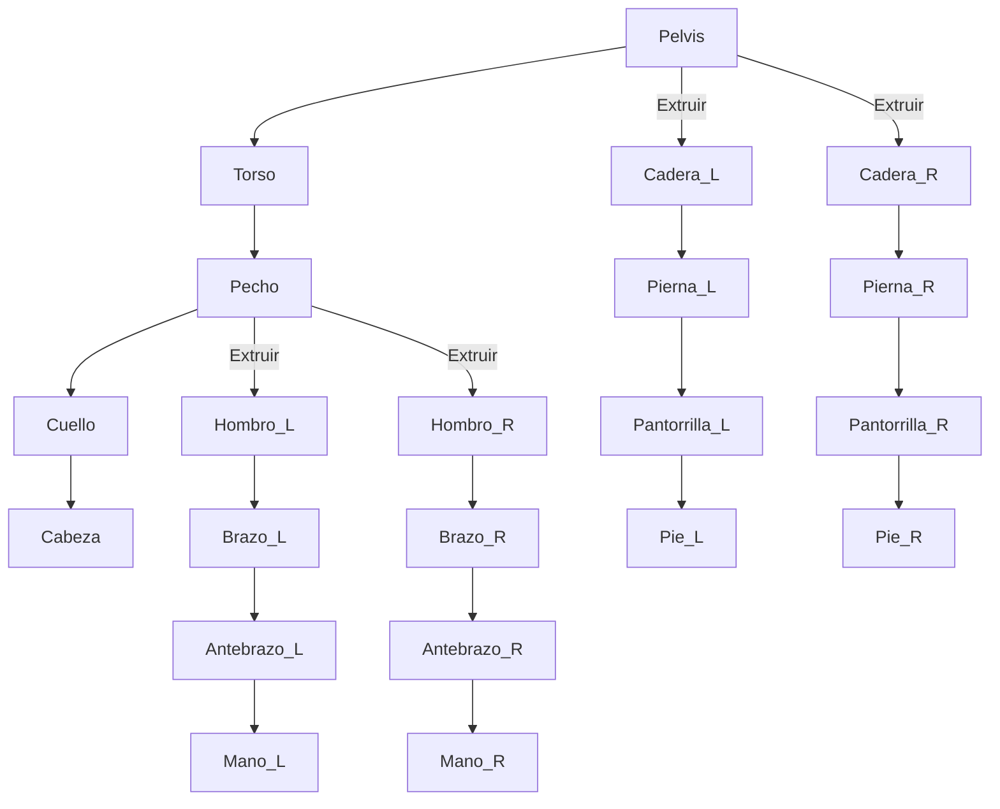

# 🎬 Tutorial Completo de Rigging 2D en Blender: De Cero a Héroe


<details>
<summary>📋 <b>Tabla de Contenidos</b> (Haz clic para expandir)</summary>

- [1. Prerrequisitos](#1-prerrequisitos)
- [2. Paso a Paso: Creación del Rig](#2-paso-a-paso-creación-del-rig)
- [3. Parentesco y Weight Painting](#3-parentesco-y-weight-painting)
- [4. Cinemática Inversa (IK)](#4-cinemática-inversa-ik---magia-para-animar)
- [5. Videos de Referencia](#5-videos-de-referencia-más-recursos)
- [6. Subir a GitHub](#6-subir-a-github)

</details>

---

¡Bienvenido a esta guía completa sobre rigging 2D en Blender! El **rigging** es el proceso de crear un esqueleto (armature) para un personaje, permitiendo que cobre vida a través de la animación. Aunque Blender es famoso por su entorno 3D, sus herramientas para animación 2D son increíblemente potentes y versátiles.

En este tutorial, no solo aprenderás a construir un esqueleto, sino también a implementar técnicas avanzadas como la **Cinemática Inversa (IK)** para lograr movimientos fluidos y naturales.


---

## 1. Prerrequisitos

Antes de sumergirnos en el mundo del rigging, asegúrate de tener todo listo:

*   **Blender:** Descarga la última versión desde [blender.org](https://www.blender.org/download/). Este tutorial es compatible con Blender 2.8x y versiones posteriores.
*   **Imagen del Personaje:** Es fundamental que tengas una imagen de tu personaje con las **partes del cuerpo separadas** (cabeza, torso, brazo, antebrazo, etc.). Lo ideal es tener cada parte como un archivo PNG con fondo transparente.

> [!TIP]
> **Consejo de Diseño:** Un buen diseño de personaje, ya separado por piezas desde su concepción, te ahorrará mucho tiempo y te facilitará enormemente el proceso de rigging.

---

## 2. Paso a Paso: Creación del Rig

### Paso 2.1: Preparar el Espacio de Trabajo

1.  Abre Blender y selecciona `2D Animation`. Esto configura el entorno ideal para nuestro trabajo.
2.  Asegúrate de estar en la **vista de cámara** (`Numpad 0`) y en modo ortográfico.
3.  Importa las partes de tu personaje usando `Add > Image > As Planes`. Si no encuentras esta opción, actívala en `Edit > Preferences > Add-ons` buscando "Import Images as Planes".
4.  Organiza las diferentes partes del cuerpo en la vista, ensamblando a tu personaje.

### Paso 2.2: Creación del Esqueleto (Armature)

El esqueleto es el corazón de nuestro rig.

1.  Coloca el cursor 3D en el centro de tu personaje (`Shift + C`).
2.  Añade una armadura: `Add > Armature`.
3.  En las propiedades del `Armature`, ve a `Viewport Display` y activa **`In Front`**. Esto mantendrá los huesos siempre visibles.


### Paso 2.3: Construyendo el Esqueleto

Vamos a darle forma a ese esqueleto.

1.  Entra en **`Edit Mode`** (`Tab`).
2.  Mueve y escala el primer hueso para que se ajuste a la **pelvis** o al **torso inferior**.
3.  Selecciona la punta de un hueso y presiona **`E`** para extruir nuevos huesos, formando la columna, el cuello y la cabeza.
4.  Para las extremidades, extruye desde las articulaciones (hombros y caderas) para crear los brazos y las piernas.

<details>
<summary>🦴 <b>Ver Diagrama Conceptual del Esqueleto</b></summary>

A continuación se muestra la sugerencia de jerarquía para los huesos principales:



</details>

### Paso 2.4: Nombrar los Huesos

Un rig bien organizado es un rig feliz. En `Edit Mode`, selecciona un hueso y presiona `F2` para renombrarlo. Usa sufijos como **`.L`** (izquierda) y **`.R`** (derecha).

---

## 3. Parentesco y Weight Painting

### Paso 3.1: Conectando el Personaje al Esqueleto

1.  En `Object Mode`, selecciona todas las partes de la malla de tu personaje, y finalmente, con `Shift + Click`, selecciona el `Armature`.
2.  Presiona `Ctrl + P` y elige **`With Automatic Weights`**.

### Paso 3.2: El Arte del Weight Painting

`Automatic Weights` es un buen punto de partida, pero el **`Weight Painting`** te da el control total.

1.  Selecciona el `Armature`, luego la malla, y entra en **`Weight Paint Mode`** (`Ctrl + Tab`).
2.  En el `Armature`, entra en **`Pose Mode`** para poder mover los huesos y ver cómo afectan a la malla en tiempo real.
3.  Selecciona un hueso (en `Pose Mode`) y pinta sobre la malla para ajustar su influencia: **rojo** para máxima influencia, **azul** para nula.


---

## 4. Cinemática Inversa (IK) - ¡Magia para Animar!

La Cinemática Inversa (IK) te permite mover una cadena de huesos (como un brazo o una pierna) simplemente moviendo el último hueso de la cadena (la mano o el pie).

### Paso 4.1: Creando el Hueso Controlador IK

1.  En `Edit Mode`, selecciona la punta de la mano o el pie y extruye un nuevo hueso (`E`).
2.  Desconéctalo de la cadena principal: `Alt + P > Clear Parent`.
3.  Nómbralo claramente, por ejemplo, `control_mano.L`.

### Paso 4.2: Aplicando la Restricción IK

1.  Ve a **`Pose Mode`**.
2.  Selecciona el hueso del **antebrazo** (o la pantorrilla).
3.  Ve al panel de `Bone Constraints` (el icono de la cadena) y añade una restricción **`Inverse Kinematics`**.
4.  En la configuración de la restricción:
    *   **Target:** Elige tu `Armature`.
    *   **Bone:** Selecciona el hueso controlador que creaste (`control_mano.L`).
    *   **Chain Length:** Ajústalo a `2` para que afecte al antebrazo y al brazo.

> [!NOTE]
> ¡Al mover el hueso controlador que acabas de configurar, todo el brazo se moverá de forma conectada natural!

---

## 5. Videos de Referencia (¡Más Recursos!)

Para una comprensión más visual y profunda, estos tutoriales son oro puro:

1.  **2D Cutout Animation in Blender (Completo):**
    *   [Ver en YouTube](https://www.youtube.com/watch?v=oqyW-i32W_0)
    *   Un clásico que cubre todo el proceso.

2.  **Blender 2D Rigging for Beginners (Ideal para empezar):**
    *   [Ver en YouTube](https://www.youtube.com/watch?v=JL87x9R3lYM)
    *   Claro, conciso y perfecto para principiantes.

3.  **Advanced 2D Rigging (Técnicas Pro):**
    *   [Ver en YouTube](https://www.youtube.com/watch?v=CQKQk0qw5W8)
    *   Explora conceptos más avanzados para llevar tu rig al siguiente nivel.

4.  **¡NUEVO! Rigging con IK en Blender para 2D:**
    *   [Ver en YouTube](https://www.youtube.com/watch?v=H9s51TbgKFI)
    *   Un excelente tutorial enfocado específicamente en la configuración de IK para personajes 2D.

5.  **¡NUEVO! Animación de Personajes 2D en Blender:**
    *   [Ver en YouTube](https://www.youtube.com/watch?v=CUrfA6MXU2E)
    *   Una vez que tu rig esté listo, este video te enseñará a darle vida.

---

## 6. Subir a GitHub

Mantén tu repositorio actualizado con tu increíble trabajo.

1.  **Añade, confirma y sube tus cambios:**
    ```bash
    # Navega a la carpeta de tu repositorio si no estás en ella
    cd Topicos-Avanzados-De-Programacion-Unidad-2
    
    # Añade todos los archivos nuevos o modificados
    git add .
    
    # Crea un commit con un mensaje descriptivo
    git commit -m "Tutorial de rigging 2D mejorado con IK y más recursos"
    
    # Sube los cambios a GitHub
    git push origin main
    ```

[↑ Volver al inicio](#-tutorial-completo-de-rigging-2d-en-blender-de-cero-a-héroe)

---

> ✨ **Documento elaborado para Tópicos Avanzados de Programación.** ¡Dale una estrella ⭐ al repositorio si te fue de utilidad!
