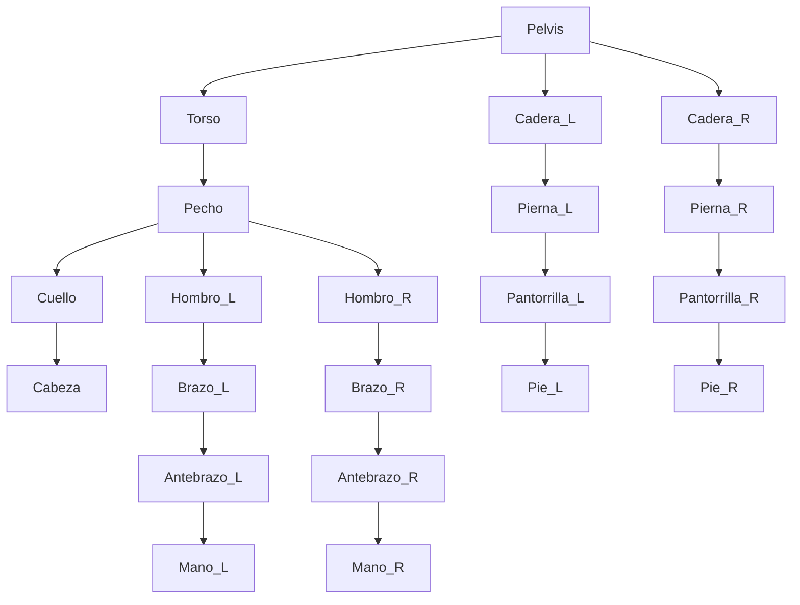

# Tutorial Completo de Rigging 2D en Blender

¡Bienvenido a este tutorial sobre rigging 2D en Blender! El rigging es el proceso de crear un esqueleto (armature) para un personaje u objeto para que pueda ser animado. Aunque Blender es un software 3D, tiene herramientas muy potentes para crear animaciones 2D de alta calidad.

En esta guía, aprenderás a crear un sistema de huesos para un personaje 2D, similar al de la imagen de referencia, para prepararlo para la animación.


---

## 1. Prerrequisitos

Antes de comenzar, asegúrate de tener lo siguiente:

*   **Blender:** Descarga la última versión desde [blender.org](https://www.blender.org/download/). Este tutorial es compatible con Blender 2.8x y versiones posteriores.
*   **Imagen del Personaje:** Necesitarás una imagen de tu personaje con las partes del cuerpo separadas (cabeza, torso, brazos, piernas, etc.) en capas o como archivos PNG transparentes. Esto facilita el proceso de rigging.

---

## 2. Paso a Paso: Creación del Rig

### Paso 2.1: Preparar el Espacio de Trabajo

1.  Abre Blender y selecciona `2D Animation` en la pantalla de inicio. Esto preconfigurará el espacio de trabajo para animación 2D.
2.  Ve a la vista de cámara (`Numpad 0`) y asegúrate de estar en una vista ortográfica.
3.  Importa la imagen de tu personaje. Ve a `Add > Image > As Planes`. Si no ves esta opción, actívala en `Edit > Preferences > Add-ons` y busca "Import Images as Planes".
4.  Selecciona la imagen de tu personaje y asegúrate de que esté correctamente orientada.

### Paso 2.2: Creación del Esqueleto (Armature)

El esqueleto es la base de nuestro rig.

1.  Coloca el cursor 3D en el centro de tu personaje (`Shift + C` y luego ajusta si es necesario).
2.  Añade una armadura: `Add > Armature`. Aparecerá un solo hueso.
3.  En el panel de propiedades del `Armature`, ve a `Viewport Display` y activa la opción `In Front`. Esto asegurará que los huesos siempre sean visibles por encima de tu personaje.


### Paso 2.3: Construyendo el Esqueleto

Ahora, extruiremos el hueso inicial para formar el esqueleto completo.

1.  Selecciona el `Armature` y entra en `Edit Mode` (`Tab`).
2.  Mueve y escala el primer hueso para que se ajuste a una parte del cuerpo, como la pelvis o el torso.
3.  Selecciona la punta (círculo pequeño) de un hueso y presiona `E` para extruir un nuevo hueso. Crea los huesos para la columna, el cuello y la cabeza.
4.  Para las extremidades, vuelve a seleccionar la articulación correspondiente (por ejemplo, el hombro) y extruye los huesos para el brazo, antebrazo y mano. Haz lo mismo para las piernas.

**Diagrama del Esqueleto:**



### Paso 2.4: Nombrar los Huesos

Es una buena práctica nombrar cada hueso para identificarlos fácilmente. En `Edit Mode`, selecciona un hueso y presiona `F2` para renombrarlo. Usa sufijos como `.L` para la izquierda y `.R` para la derecha (ej. `brazo.L`, `brazo.R`).

---

## 3. Parentesco y Weight Painting

### Paso 3.1: Parentesco del Personaje al Esqueleto

Ahora conectaremos la malla (la imagen del personaje) al esqueleto.

1.  Sal del `Edit Mode` y ve a `Object Mode`.
2.  Selecciona primero la malla de tu personaje, luego `Shift + Click` en el `Armature`.
3.  Presiona `Ctrl + P` y selecciona `With Automatic Weights`. Blender intentará asignar automáticamente qué partes de la malla son controladas por cada hueso.

### Paso 3.2: Ajustes con Weight Painting

`Automatic Weights` no siempre es perfecto. El `Weight Painting` te permite ajustar la influencia de cada hueso sobre la malla.

1.  Selecciona el `Armature`, luego `Shift + Click` en la malla.
2.  Entra en `Weight Paint Mode` (`Ctrl + Tab`).
3.  En `Pose Mode` para el `Armature` (puedes cambiarlo en el menú de modos), selecciona un hueso para ver su influencia.
4.  Pinta sobre la malla para añadir (rojo) o quitar (azul) influencia.


---

## 4. Videos de Referencia

Para una comprensión más profunda, te recomiendo estos excelentes tutoriales en video:

1.  **2D Cutout Animation in Blender 2.8:**
    *   [Ver en YouTube](https://www.youtube.com/watch?v=wQY_2iCEHwI)
    *   Este video cubre todo el proceso, desde la importación hasta la animación.

2.  **Blender 2D Rigging Tutorial for Beginners:**
    *   [Ver en YouTube](https://www.youtube.com/watch?v=Sg8Zp4V_T8c)
    *   Un tutorial muy claro y conciso, ideal para empezar.

3.  **Advanced 2D Rigging in Blender:**
    *   [Ver en YouTube](https://www.youtube.com/watch?v=wumD9G3t43A)
    *   Para cuando te sientas más cómodo y quieras explorar técnicas más avanzadas.

---

## 5. Subir a GitHub

Una vez que hayas creado tu archivo `.md` y cualquier otro archivo de proyecto, puedes subirlos a tu repositorio de GitHub.

1.  **Clona tu repositorio:**
    ```bash
    git clone https://github.com/IKERD11/Topicos-Avanzados-De-Programacion-Unidad-2.git
    ```
2.  **Mueve tus archivos al repositorio clonado.**
3.  **Añade, confirma y sube los cambios:**
    ```bash
    cd Topicos-Avanzados-De-Programacion-Unidad-2
    git add .
    git commit -m "Añadido tutorial de rigging 2D en Blender"
    git push origin main
    ```

¡Y eso es todo! Ahora tienes un personaje 2D con rig en Blender, listo para ser animado. ¡Espero que este tutorial te haya sido de gran ayuda!
