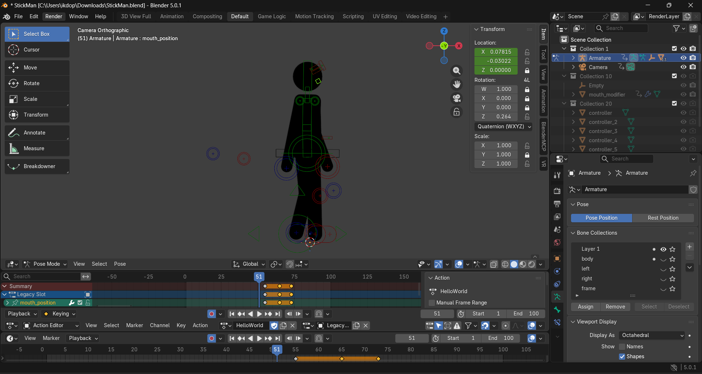
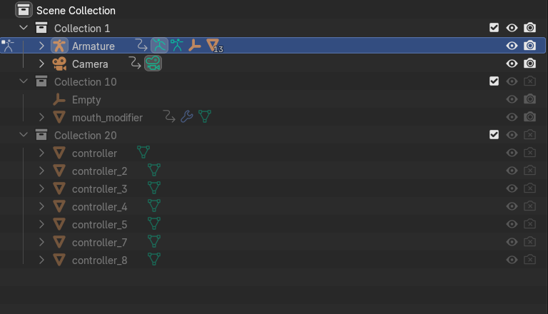
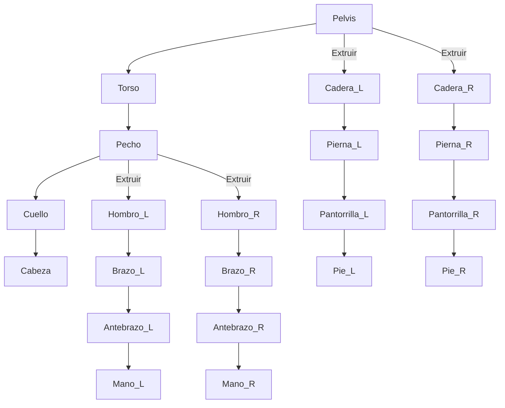
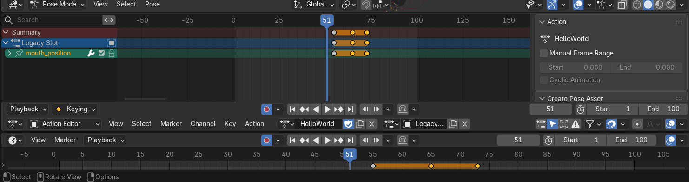
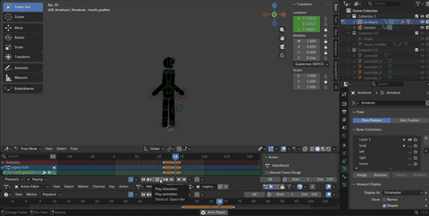

# 🎬 Tutorial Completo de Rigging 2D en Blender: De Cero a Héroe


<details>
<summary>📋 <b>Tabla de Contenidos</b> (Haz clic para expandir)</summary>

- [1. Prerrequisitos](#1-prerrequisitos)
- [2. Paso a Paso: Creación del Rig](#2-paso-a-paso-creación-del-rig)
- [3. Parentesco y Weight Painting](#3-parentesco-y-weight-painting)
- [4. Cinemática Inversa (IK)](#4-cinemática-inversa-ik---magia-para-animar)
- [5. Formas Personalizadas (Custom Bones)](#5-formas-personalizadas-custom-bones---estilizando-tu-rig)
- [6. Restricciones Avanzadas (Constraints Extra)](#6-restricciones-avanzadas-constraints-extra)
- [7. Expresiones Faciales (Shape Keys y Drivers)](#7-expresiones-faciales-shape-keys-y-drivers)
- [8. Librería de Poses (Asset Browser)](#8-librería-de-poses-asset-browser)
- [9. Interpolación y Action Editor](#9-interpolación-y-action-editor)
- [10. Animación Final](#10-animación-final)
- [11. Videos de Referencia](#11-videos-de-referencia-más-recursos)
- [12. Subir a GitHub](#12-subir-a-github)

</details>

---

¡Bienvenido a esta guía completa sobre rigging 2D en Blender! El **rigging** es el proceso de crear un esqueleto (armature) para un personaje, permitiendo que cobre vida a través de la animación. Aunque Blender es famoso por su entorno 3D, sus herramientas para animación 2D son increíblemente potentes y versátiles.

En este tutorial, no solo aprenderás a construir un esqueleto, sino también a implementar técnicas avanzadas como la **Cinemática Inversa (IK)** para lograr movimientos fluidos y naturales.

<div align="center">
  
</div>

---

## 1. Prerrequisitos

Antes de sumergirnos en el mundo del rigging, asegúrate de tener todo listo:

*   **Blender:** Descarga la última versión desde [blender.org](https://www.blender.org/download/). Este tutorial es compatible con Blender 2.8x y versiones posteriores.
*   **Imagen del Personaje:** Es fundamental que tengas una imagen de tu personaje con las **partes del cuerpo separadas** (cabeza, torso, brazo, antebrazo, etc.). Lo ideal es tener cada parte como un archivo PNG con fondo transparente.

> [!TIP]
> **Consejo de Diseño:** Un buen diseño de personaje, ya separado por piezas desde su concepción, te ahorrará mucho tiempo y te facilitará enormemente el proceso de rigging.

---

## 2. Paso a Paso: Creación del Rig

### Paso 2.1: Preparar el Espacio de Trabajo

1.  Abre Blender y selecciona `2D Animation`. Esto configura el entorno ideal para nuestro trabajo.
2.  Asegúrate de estar en la **vista de cámara** (<kbd>Numpad 0</kbd>) y en modo ortográfico.
3.  Importa las partes de tu personaje usando `Add > Image > As Planes`. Si no encuentras esta opción, actívala en `Edit > Preferences > Add-ons` buscando "Import Images as Planes".
4.  Organiza las diferentes partes del cuerpo en la vista, ensamblando a tu personaje.

<br>

### Paso 2.2: Creación del Esqueleto (Armature)

El esqueleto es el corazón de nuestro rig.

<table>
  <tr>
    <td width="60%">
      <b>1.</b> Coloca el cursor 3D en el centro de tu personaje (<kbd>Shift</kbd> + <kbd>C</kbd>). <br><br>
      <b>2.</b> Añade una armadura: <code>Add &gt; Armature</code>. <br><br>
      <b>3.</b> En las propiedades del <code>Armature</code>, ve a <code>Viewport Display</code> y activa <b><code>In Front</code></b>. Esto mantendrá los huesos siempre visibles, incluso detrás del personaje.
    </td>
    <td width="40%">
      
    </td>
  </tr>
</table>

### Paso 2.3: Construyendo el Esqueleto

Vamos a darle forma a ese esqueleto.

1.  Entra en **`Edit Mode`** (<kbd>Tab</kbd>).
2.  Mueve y escala el primer hueso para que se ajuste a la **pelvis** o al **torso inferior**.
3.  Selecciona la punta de un hueso y presiona <kbd>E</kbd> para extruir nuevos huesos, formando la columna, el cuello y la cabeza.
4.  Para las extremidades, extruye desde las articulaciones (hombros y caderas) para crear los brazos y las piernas.

<details>
<summary>🦴 <b>Ver Diagrama Conceptual del Esqueleto</b></summary>

A continuación se muestra la sugerencia de jerarquía para los huesos principales:



</details>

### Paso 2.4: Nombrar los Huesos

Un rig bien organizado es un rig feliz. En `Edit Mode`, selecciona un hueso y presiona <kbd>F2</kbd> para renombrarlo. Usa sufijos como **`.L`** (izquierda) y **`.R`** (derecha).

<div align="right"><a href="#-tutorial-completo-de-rigging-2d-en-blender-de-cero-a-héroe">⬆️ Volver al inicio</a></div>

---

## 3. Parentesco y Weight Painting

### Paso 3.1: Conectando el Personaje al Esqueleto

1.  En `Object Mode`, selecciona todas las partes de la malla de tu personaje, y finalmente, con <kbd>Shift</kbd> + **Clic**, selecciona el `Armature`.
2.  Presiona <kbd>Ctrl</kbd> + <kbd>P</kbd> y elige **`With Automatic Weights`**.

### Paso 3.2: El Arte del Weight Painting

`Automatic Weights` es un buen punto de partida, pero el **`Weight Painting`** te da el control total de qué vértice sigue a qué hueso.

<table>
  <tr>
    <td width="60%">
      <b>1.</b> Selecciona el <code>Armature</code>, luego la malla, y entra en <b><code>Weight Paint Mode</code></b> (<kbd>Ctrl</kbd> + <kbd>Tab</kbd>). <br><br>
      <b>2.</b> En el <code>Armature</code>, entra en <b><code>Pose Mode</code></b> para poder mover los huesos y ver cómo afectan a la malla en tiempo real. <br><br>
      <b>3.</b> Selecciona un hueso (en <code>Pose Mode</code>) y pinta sobre la malla para ajustar su influencia: 🔴 <b>rojo</b> para máxima influencia, 🔵 <b>azul</b> para nula.
    </td>
    <td width="40%">
      
    </td>
  </tr>
</table>

<div align="right"><a href="#-tutorial-completo-de-rigging-2d-en-blender-de-cero-a-héroe">⬆️ Volver al inicio</a></div>

---

## 4. Cinemática Inversa (IK) - ¡Magia para Animar!

La Cinemática Inversa (IK) te permite mover una cadena de huesos (como un brazo o una pierna) simplemente moviendo el último hueso de la cadena (la mano o el pie).

### Paso 4.1: Creando el Hueso Controlador IK

1.  En `Edit Mode`, selecciona la punta de la mano o el pie y extruye un nuevo hueso (<kbd>E</kbd>).
2.  Desconéctalo de la cadena principal: <kbd>Alt</kbd> + <kbd>P</kbd> > `Clear Parent`.
3.  Nómbralo claramente, por ejemplo, `control_mano.L`.

### Paso 4.2: Aplicando la Restricción IK

1.  Ve a **`Pose Mode`**.
2.  Selecciona el hueso del **antebrazo** (o la pantorrilla).
3.  Ve al panel de `Bone Constraints` (el icono de la cadena) y añade una restricción **`Inverse Kinematics`**.
4.  En la configuración de la restricción:
    *   **Target:** Elige tu `Armature`.
    *   **Bone:** Selecciona el hueso controlador que creaste (`control_mano.L`).
    *   **Chain Length:** Ajústalo a `2` para que afecte al antebrazo y al brazo.

> [!NOTE]
> ¡Al mover el hueso controlador que acabas de configurar, todo el brazo se moverá de forma conectada natural!

---

## 5. Formas Personalizadas (Custom Bones) - Estilizando tu Rig

Una vez que tu esqueleto y la IK funcionan correctamente, ver tantos huesos octaédricos (las formas por defecto) puede volverse confuso. Los **Custom Bones** (huesos personalizados) te permiten reemplazar la apariencia de los huesos por mallas geométricas (círculos, flechas, cuadrados) sin alterar sus funciones mecánicas.

Esto es un estándar en la industria porque logra que el rig sea interactivo, limpio y mucho más intuitivo para el animador (evitando clics accidentales).

### 5.1. El Arte de Modelar un Controlador (Widgets)

No necesitas ser un modelador 3D experto, pero sí debes conocer la principal regla de oro: **Los controladores bajo ningún motivo deben tapar la visión del animador.** 

Para lograr esto, las mallas que crees deben ser puros **Edges** (bordes o alambres) sin ninguna cara (**Faces**). 

<details>
<summary><b>▶️ Ver Método A: Creación mediante primitivas (Rápido)</b></summary>
<br>

1. En **`Object Mode`**, presiona <kbd>Shift</kbd> + <kbd>A</kbd> > `Mesh` > `Circle`.
2. Una vez que aparezca, ábrelo en el menú inferior izquierdo y activa **"Align to View"** para que lo veas completamente de frente.
3. Selecciona tu Círculo, entra en **`Edit Mode`** (<kbd>Tab</kbd>) y presiona <kbd>X</kbd> > `Only Faces` por si generó alguna.
4. Redimensiona y ajusta los vértices moviéndolos (<kbd>G</kbd>) o escalándolos (<kbd>S</kbd>) hasta lograr la forma general que desees.
</details>

<details>
<summary><b>▶️ Ver Método B: La técnica del "Vértice Único" (Para dibujar figuras complejas como Flechas)</b></summary>
<br>

1. Crea un Plano estándar desde *Object Mode*.
2. Entra a **`Edit Mode`**, selecciona todo (<kbd>A</kbd>), presiona <kbd>M</kbd> y selecciona **`Merge At Center`**. ¡Ahora solo tienes un vértice microscópico en todo el plano!
3. Pulsa <kbd>G</kbd> para mover la posición inicial de tu vértice.
4. Presiona <kbd>E</kbd> para extruir (crear un nuevo vértice conectado por un borde). Sigue oprimiendo <kbd>E</kbd> repetidamente como si estuvieras trazando una línea para dibujar paso a paso cruces, flechas curvas, o perfiles personalizados que tengan sentido para ti.
5. Selecciona el vértice final y el inicial presionando <kbd>Shift</kbd> + Clic izquierdo y presiona <kbd>F</kbd> para cerrar la figura. ¡Listo! Has dibujado a mano alzada tu controlador.
</details>

---

### 5.2. El Secreto del "Centro de Origen" (Origin Point)
Uno de los errores más comunes al hacer Rigging es que el controlador aparezca muy lejos del hueso real, y muchas veces esto se debe al *Punto de Origen* (el puntito naranja).

> [!CAUTION]
> **Fallo Crítico Evitado:** Cuando asignas un "Custom Bone", Blender alinea en base al origen del Hueso con el origen (Origin Point) del Widget. Si el origen de tu Widget está mal puesto, rotará sobre un eje invisible.

**Pasos para alinear el Origen a la Perfección:**
1. Selecciona tu Widget en *Object Mode*.
2. Entra en *Edit Mode*, selecciona todos los vértices (<kbd>A</kbd>).
3. Mueve la figura de forma manual (<kbd>G</kbd>) de modo que el **puntito naranja de origen** quede exactamente donde quieres que el controlador rote.
   * *Ejemplo:* Si es un círculo para el codo, el punto naranja debe estar al exacto centro del círculo.
4. Vuelve a *Object Mode* e inmediatamente aplícale la escala para evitar deformaciones raras después, presionando <kbd>Ctrl</kbd> + <kbd>A</kbd> > `Scale` & `Rotation`.

---

### 5.3. Asignación al Esqueleto y Resolviendo "El Problema de la Rotación Escasa"
Ahora asignaremos esta forma que acabas de pulir a tus huesos de control (IKs).

1. En **`Object Mode`**, presiona <kbd>F2</kbd> en tu nueva figura para renombrarla usando el prefijo universal: `WGT_Mano.L`.
2. Luego ponla en una *Collection* diferente (<kbd>M</kbd>) llamada `Rig_Shapes` y escóndela usando el ojo en el *Outliner*.
3. Selecciona tu esqueleto principal (Armature) y pásalo a **`Pose Mode`** (<kbd>Ctrl</kbd> + <kbd>Tab</kbd>).
4. Selecciona tu hueso controlador.
5. Ve a **`Bone Properties`** (Hueso Verde) > **`Viewport Display`** > **`Custom Object`** y selecciona tu malla `WGT_Mano.L`.

#### 🔴 ¡Mi forma no mira hacia donde debería!
A diferencia del modo objeto, las formas personalizadas suelen importarse con la rotación predeterminada del hueso (la Y es hacia arriba, X es a los lados, Z hacia atrás y hacia adelante del personaje en el eje Local). 

Si tu forma está "costeada" u "horizontal":
1. Dentro del mismo panel `Viewport Display` en tu hueso, debajo de la sección donde escogiste el `Custom Object`, verás tres casillas de **`Rotation` (X, Y, Z)**.
2. Comienza a mover el valor **X** en tramos de 90° grados (90, -90). ¡Verás tu figura rotar sobre su propio eje hasta acomodarse de frente!
3. Haz lo mismo con el valor **`Scale`** para agrandar globalmente el controlador en su lugar. Esta escala se aplica *únicamente* de manera visual y no afecta los datos brutos de la animación. 

### 5.4. Estilizado Profesional: Grupos de Color
Los *Custom Bones* se ven bien, ¡pero los colores marcan la diferencia entre Novato y Pro!

1. Con tu Armature seleccionado en **`Pose Mode`**, ve a la pestaña **`Object Data Properties`** (el ícono verde del muñeco de palo, arriba del hueso).
2. Abre la sección de **`Bone Collections`** o **`Bone Groups`** (dependiendo de la versión).
3. Añade con el "plus" `+` algunas de las categorías comunes:
   * **Controladores_Izquierdos**: Asígnales un tema global desde el selector de Color Set (normalmente ROJO).
   * **Controladores_Derechos**: Asígnales color (normalmente AZUL).
   * **Controladores_Centro** (Root, Cintura): Asígnales color (normalmente AMARILLO o VERDE).
4. Luego, con todos tus *Custom Bones* de un lado seleccionados en el viewport, ve a este mismo panel y dale a **"Assign"**.
¡Listo! Tus controladores ahora son coloridos, intuitivos y maravillosamente claros. Te evitará animar el brazo derecho cuando jurabas haber tomado el controlador del izquierdo.

> [!TIP]
> **Check de seguridad:** En las opciones globales de `Viewport Display` (panel Armature), asegúrate de que **`Wireframe`** esté activo. Esto previene que si, por descuido, tu widget tiene una "Cara/Face" invisible, actúe tapando en sombra a tu dibujo.

---

### Extra: Estándares Geométricos de la Industria 🎨
Para darle consistencia visual a tu Rig, intenta crear y guardar en tu archivo principal (`Rig_Shapes`) el siguiente pack de geometrías de alambres:

| Parte del Cuerpo | Tipo de Controlador "Custom Bone" Sugerido |
| :--- | :--- |
| **Raíz / Root** (El que mueve todo) | Círculo grande con cuatro enormes flechas cardinales extruídas. Debe estar a los pies del personaje, tocando la línea 0 de la cuadrícula mundial. |
| **IK de Manos y Pies** | Cuadros o cajas (creadas extruyendo planos, no con Solidify) que encuadren la zona de apoyo de la palma o el talón. |
| **Codos y Rodillas (Pole Targets)** | Diminutas esferas dibujadas a mano, o cruces (X) que floten exactamente en el espacio detrás de los codos. Al ser un objetivo que la rodilla persigue, una "mirilla" o "diana" dibujada sirve perfectamente. |
| **Huesos del Torso/Columna** | Aros simples, escalados a lo ancho o ajustados a la silueta de los hombros, como una rebanada de cebolla visual. |
| **Huesos Faciales (Si tu rig escala hasta allí)** | Pequeñas pirámides huecas o esferitas planas. |

<div align="right"><a href="#-tutorial-completo-de-rigging-2d-en-blender-de-cero-a-héroe">⬆️ Volver al inicio</a></div>

---

## 6. Restricciones Avanzadas (Constraints Extra)

La Cinemática Inversa (IK) es solo el principio. Para que un Rig 2D sea verdaderamente indestructible y el animador no lo "rompa" por error, debes añadir estas restricciones (Constraints) a tus huesos.

### Limit Rotation 🛑
Evita que el codo o la rodilla se doble de forma antinatural (impidiendo que la extremidad parezca fracturada).
* **Cómo usar:** En Modo Pose, selecciona el hueso de la pantorrilla, ve a `Bone Constraints` > `Limit Rotation`. Activa los límites en el eje local (usualmente el eje Z o X en 2D) impidiendo que se doble más allá de 0° hacia atrás y 140° hacia adelante.

### Copy Rotation 🔄
Obliga a un hueso a imitar la rotación de otro. Perfecto para mechas de pelo, faldas o mangas que deben reaccionar cuando el personaje gira el torso.
* **Cómo usar:** `Bone Constraints` > `Copy Rotation`. Eliges el `Target` (el cuerpo) y asignas un % de influencia (ej. 0.5 para que la falda gire la mitad de lo que gira la cadera).

### Stretch To (Efecto Chicle) 🍬
La regla principal de la animación tradicional es "Squash & Stretch" (Encoger y Estirar). Con esto, si un controlador IK se aleja más de la longitud del brazo, el brazo se estirará como goma en lugar de desconectarse.
* **Cómo usar:** Selecciona los huesos de tu brazo IK > `Bone constraints` > `Stretch To` > Elige el controlador de la mano.

<div align="right"><a href="#-tutorial-completo-de-rigging-2d-en-blender-de-cero-a-héroe">⬆️ Volver al inicio</a></div>

---

## 7. Expresiones Faciales (Shape Keys y Drivers)

Para animar caras (como cerrar ojos o cambiar de vocal en la boca) en animación 2D Cutout o geometría plana, usar huesos tradicionales deforma muy feo la malla. En su lugar, usamos "Shape Keys".

### Paso 7.1: Crear Shape Keys
1. Selecciona el objeto de tu cara en **`Object Mode`**.
2. Ve al panel de `Object Data Properties` (Triángulo verde) > sección **`Shape Keys`**.
3. Da clic al `+` dos veces. El primero creará la clave "Basis" (la cara base neutra) y el segundo la "Key 1" (nómbrala "Ojo_Cerrado").
4. Selecciona "Ojo_Cerrado", entra a **`Edit Mode`** y mueve los vértices del ojo hasta cerrarlo. Al volver a Object Mode, usa el deslizador de *Value* (de 0.0 a 1.0) para ver cómo parpadea mágicamente.

### Paso 7.2: Controlarlas con Drivers (Magia negra)
Mover un deslizador sin estar en el Rig es molesto. ¡Conectémoslo a un Hueso Custom!
1. En tu ventana, abre un menú de **`Drivers`**.
2. Haz clic derecho en el cuadro *Value* de tu Shape Key y selecciona **`Add Driver`**.
3. En la ventana emergente, configura el Driver asociando la rotación (o posición Local Y) de tu Hueso controlador de la cara al valor de la Shape Key. 
4. ¡Baila! Ahora, cada vez que bajes el huesito diminuto en el rostro, el ojo se cerrará.

<div align="right"><a href="#-tutorial-completo-de-rigging-2d-en-blender-de-cero-a-héroe">⬆️ Volver al inicio</a></div>

---

## 8. Librería de Poses (Asset Browser)

Repetir las mismas poses de las manos (puño, señalar, mano abierta) miles de veces es agotador. Blender tiene un **Pose Library** para guardar posturas y aplicarlas al instante.

1. Abre un panel como **`Asset Browser`**.
2. Con tu personaje en **`Pose Mode`**, posiciona las manos (los huesos necesarios) para formar un Puño. Selecciona solo esos huesos.
3. Arriba en tu área 3D (Asset Browser) haz clic en **`Create Pose Asset`**.
4. ¡Se creará una miniatura! Nómbrala "Mano_Puño".
5. La próxima vez, solo debes arrastrar esa miniatura sobre tu personaje y la mano cambiará al instante a esa pose. Puedes crear una inmensa librería de bocas y manos (A, E, I, O, U, Cerrada, Furioso).

<div align="right"><a href="#-tutorial-completo-de-rigging-2d-en-blender-de-cero-a-héroe">⬆️ Volver al inicio</a></div>

---

## 9. Interpolación y Action Editor

Una vez que sabes mover huesos y expresiones, la forma en que Blender calcula los trayectos entre Keyframes (Fotogramas Clave) determina el "arte" final de la animación.

### Tipos de Interpolación (Presiona <kbd>T</kbd> en el Timeline):
* **Bezier (Por defecto):** Suaviza la aceleración y la salida (Ease In/Out). Se ve moderno pero a costa de parecer "demasiado fluido o artificial" para 2D.
* **Linear:** Velocidad absolutamente robótica y continua.
* **Constant:** **¡El favorito del 2D!** Congela la animación en ese fotograma hasta la siguiente pose. Usando *Constant* puedes simular animación tradicional "En dos" (Drop 12 frames per second estilo Spider-Verse).

### Action Editor: 
No animes el salto y la carrera en la misma línea de tiempo gigante.
Ve al **`Dope Sheet`**, cámbialo al modo **`Action Editor`**. Aquí podrás crear "Bloques" de animación. Por ejemplo, pulsas `New` y nombras la acción "Correr_Loop". La finalizas, presionas la escudita de `Fake User` (para guardarla) y creas una nueva llamada "Saltar". Así ordenas tu proyecto a nivel Pro.

<div align="right"><a href="#-tutorial-completo-de-rigging-2d-en-blender-de-cero-a-héroe">⬆️ Volver al inicio</a></div>

---

## 10. Animación Final

<div align="center">
  <h3>¡Mira el resultado en acción! 🎥</h3>
  
</div>

---

## 11. Videos de Referencia (¡Más Recursos!)

Para una comprensión más visual y profunda, estos tutoriales son oro puro:

1.  **2D Cutout Animation in Blender (Completo):**
    *   [Ver en YouTube](https://www.youtube.com/watch?v=oqyW-i32W_0)
    *   Un clásico que cubre todo el proceso.

2.  **Blender 2D Rigging for Beginners (Ideal para empezar):**
    *   [Ver en YouTube](https://www.youtube.com/watch?v=JL87x9R3lYM)
    *   Claro, conciso y perfecto para principiantes.

3.  **Advanced 2D Rigging (Técnicas Pro):**
    *   [Ver en YouTube](https://www.youtube.com/watch?v=CQKQk0qw5W8)
    *   Explora conceptos más avanzados para llevar tu rig al siguiente nivel.

4.  **¡NUEVO! Rigging con IK en Blender para 2D:**
    *   [Ver en YouTube](https://www.youtube.com/watch?v=H9s51TbgKFI)
    *   Un excelente tutorial enfocado específicamente en la configuración de IK para personajes 2D.

5.  **¡NUEVO! Animación de Personajes 2D en Blender:**
    *   [Ver en YouTube](https://www.youtube.com/watch?v=CUrfA6MXU2E)
    *   Una vez que tu rig esté listo, este video te enseñará a darle vida.

### 🦴 Referencias Especiales: Dominando los Custom Bones
Si quieres dominar por completo el *Capítulo 5* de este tutorial, te recomendamos estos videos enfocados exclusivamente en controladores:

6.  **Cómo modelar Custom Bone Shapes paso a paso:**
    *   [Ver Búsqueda en YouTube](https://www.youtube.com/results?search_query=Blender+Custom+Bone+Shapes+Tutorial)
    *   Tutoriales visuales de cómo la comunidad moldea alambres, círculos y flechas para convertirlos en controladores (Widgets) para sus personajes.

7.  **Arreglando Rotaciones y Escalas de Custom Bones:**
    *   [Ver Búsqueda en YouTube](https://www.youtube.com/results?search_query=Blender+Custom+Bone+Rotation+Fix)
    *   Ideal si tu controlador queda apuntando hacia otro lado o el "Punto de Origen" se desfasó. Una vista práctica a cómo aplicar el `Ctrl + A` correctamente en Edit Mode.

8.  **Uso de Scripts y Addons para Custom Bones Automáticos:**
    *   [Ver Búsqueda en YouTube](https://www.youtube.com/results?search_query=Blender+Bone+Custom+Shapes+Addon)
    *   Muestra cómo instalar Addons gratuitos (como *Bone Widget*) que incluyen galerías prefabricadas de flechas y cajas para que escupas controladores con 1 solo clic.

---

## 12. Subir a GitHub

Mantén tu repositorio actualizado con tu increíble trabajo.

1.  **Añade, confirma y sube tus cambios:**
    ```bash
    # Navega a la carpeta de tu repositorio si no estás en ella
    cd Topicos-Avanzados-De-Programacion-Unidad-2
    
    # Añade todos los archivos nuevos o modificados
    git add .
    
    # Crea un commit con un mensaje descriptivo
    git commit -m "Tutorial de rigging 2D mejorado con IK y más recursos"
    
    # Sube los cambios a GitHub
    git push origin main
    ```

[↑ Volver al inicio](#-tutorial-completo-de-rigging-2d-en-blender-de-cero-a-héroe)

---

> ✨ **Documento elaborado para Tópicos Avanzados de Programación.** ¡Dale una estrella ⭐ al repositorio si te fue de utilidad!
