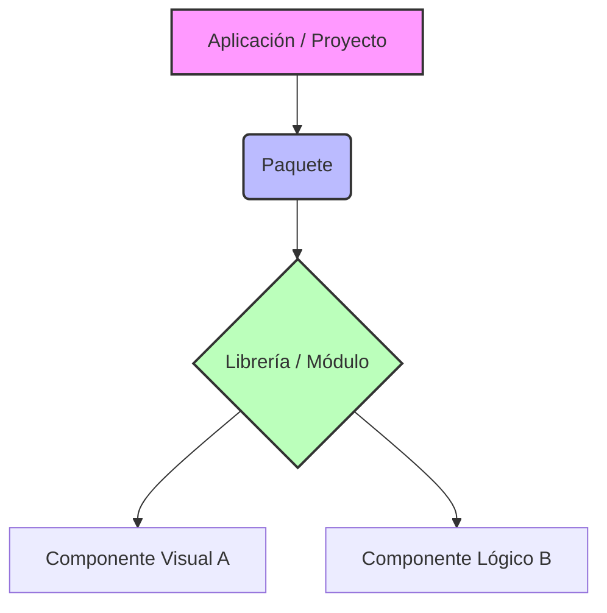

# Tema 2.1: Definición conceptual de componentes, paquetes y librerías

## 1. Componente
Un **componente de software** es una unidad modular, independiente y reemplazable de un sistema que encapsula su implementación y expone un conjunto bien definido de interfaces. Los componentes están diseñados para ser reutilizables en diferentes contextos y aplicaciones, facilitando así el desarrollo de software complejo.

*   **Ejemplo conceptual:** En una aplicación GUI de Python (usando Flet), un botón (`ft.ElevatedButton`) o un campo de texto (`ft.TextField`) actúan como componentes visuales predefinidos.

### Características de un Buen Componente:
*   **Alta Cohesión:** El componente debe estar enfocado en hacer una sola cosa y hacerla bien. Todos sus métodos y atributos internos deben estar al servicio de ese propósito único.
*   **Bajo Acoplamiento:** Los componentes deben interactuar entre sí sabiendo lo menos posible del "cómo" lo hacen los demás componentes. De este modo, si modificamos el componente A, no corremos peligro de que el componente B se rompa.
*   **Modularidad y Contratos (Interfaces):** Un componente debe tener una forma pública clara de ser usado, actuando como un "contrato" o "promesa" que asegura qué entradas recibe y qué resultados o salidas proporciona.

#### Ejemplo de Código: Cohesión y Acoplamiento (Mal vs Buen Diseño)
```python
# ❌ MAL DISEÑO: Un solo lugar hace TODO (Baja cohesión y alto acoplamiento)
class SuperSistemaJuego:
    def jugar(self):
        # Lógica de dibujar jugador
        print("Dibujando...")
        # Lógica de guardar en base de datos
        db = open("db.txt", "w")
        db.write("guardado")
        db.close()

# ✅ BUEN DISEÑO: Componentes separados interactuando por interfaces claras
class Renderizador:
    def dibujar(self, entidad):
        print(f"Dibujando a {entidad}...")

class BaseDeDatos:
    def guardar(self, datos):
        with open("db.txt", "w") as f:
            f.write(datos)

class Juego:
    # Recibimos las dependencias mediante inyección (Bajo acoplamiento)
    def __init__(self, renderizador, db):
        self.renderizador = renderizador
        self.db = db
        
    def jugar(self):
        self.renderizador.dibujar("Héroe")
        self.db.guardar("Estado actual")
```

## 2. Librería (Biblioteca)
Una **librería** (o biblioteca) es una colección de implementaciones de comportamiento (código), escrita en términos de un lenguaje, que tiene una interfaz bien definida por la cual se invoca el comportamiento. Las librerías facilitan la reutilización de código. No proporcionan un flujo de control estructurado (como lo haría un *framework*), sino que el desarrollador invoca funciones de la librería según lo necesario.

*   **Ejemplo común:** La librería estándar de Python (`math`, `datetime`, `random`) que proporciona funciones matemáticas y manejo de fechas.
*   **Ejemplo de terceros:** `Flet`, utilizada para construir aplicaciones de interfaz de usuario.

### Librería vs. Framework (La Inversión de Control)
A menudo los conceptos "Librería" y "Framework" (marco de trabajo) se confunden. La diferencia más importante se conoce como **Inversión de Control (IoC)**:
*   **En una Librería:** Tú tienes el volante. Tu código llama a las funciones de la librería conforme lo necesitas (ej. `math.sqrt()` o `random.randint()`). Eres dueño del flujo principal de tu programa.
*   **En un Framework:** El framework tiene el volante. Es él quien establece la arquitectura general y llama a tu código mediante mecanismos de retorno (callbacks, eventos o hooks) cuando ocurre algo en el ciclo de vida de la aplicación de lo cual tú debes encargarte.

## 3. Paquete
En Python, un **paquete** (o *package*) es una forma de estructurar los espacios de nombres de los módulos utilizando "nombres de módulos con puntos". En términos más simples, un paquete no es más que un directorio que contiene otros módulos y un archivo especial llamado `__init__.py` (aunque en versiones recientes de Python el `__init__.py` es opcional, sigue siendo una buena práctica).

Un paquete nos permite organizar múltiples módulos relacionados bajo un mismo directorio para mantener el orden en nuestro proyecto.

### Ejemplo de estructura:

```text
mi_paquete/
    __init__.py
    modulo1.py
    modulo2.py
```

## 4. Diagrama de Relación

A continuación, un diagrama que muestra cómo se estructuran jerárquicamente estos conceptos en un proyecto de software:


