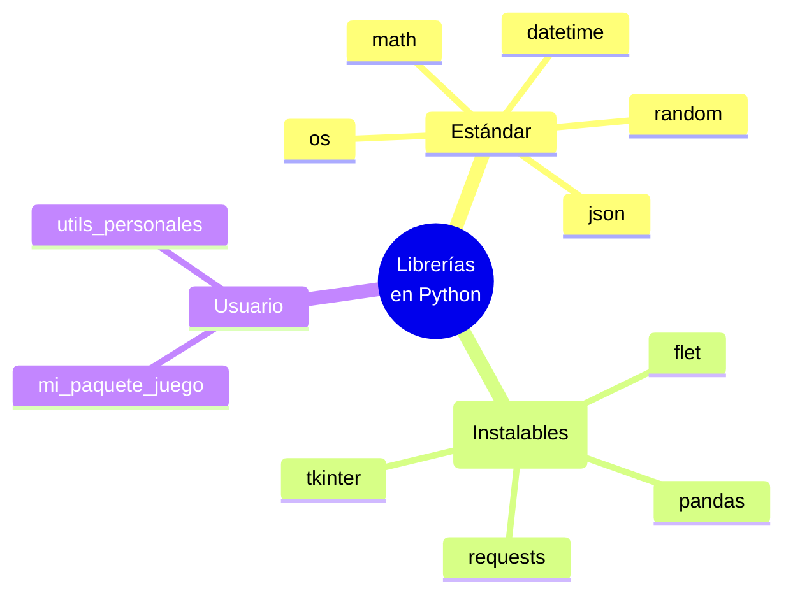

# Tema 2.2: Uso de librerías proporcionadas por el lenguaje

Python cuenta con una extensa **librería estándar** que viene instalada directamente con el intérprete. Esto significa que podemos importar y usar módulos sin tener que instalar dependencias extras (filosofía "baterías incluidas"). Además, podemos descargar e instalar librerías externas utilizando herramientas como `pip`.

## 1. Librerías de la Biblioteca Estándar
Ejemplos comunes que utilizamos a diario para resolver problemas matemáticos, medir tiempos, o lidiar con sistemas operativos.

### Ejemplo Práctico: `math` y `random`
```python
import math
import random

# Uso de la librería 'math' proporcionada por Python
radio = 5
area = math.pi * math.pow(radio, 2)
print(f"Área del círculo de radio 5: {area:.2f}")

# Uso de la librería 'random' proporcionada por Python
numero_aleatorio = random.randint(1, 100)
print(f"Número aleatorio entre 1 y 100: {numero_aleatorio}")
```

### Ejemplo Práctico adicional: `datetime` y `json`
Estas son otras librerías muy utilizadas de la biblioteca estándar:
```python
import datetime
import json

# Uso de datetime para obtener la fecha de hoy
hoy = datetime.datetime.now()
print(f"Fecha actual: {hoy.strftime('%Y-%m-%d %H:%M:%S')}")

# Uso de json para serializar un diccionario (guardar datos)
datos_jugador = {"nombre": "Heroe", "nivel": 10, "inventario": ["pocion", "espada"]}
json_str = json.dumps(datos_jugador, indent=4)
print(f"Datos en formato JSON:\n{json_str}")
```

### Interacción Avanzada con el Entorno: `os` y `sys`
Estas herramientas estándar son fundamentales para manipular archivos, interactuar con variables del sistema operativo o manejar procesos.

```python
import os
import sys

# Obtener y mostrar el directorio actual (Current Working Directory)
directorio_actual = os.getcwd()
print(f"Ejecutando script desde: {directorio_actual}")

# Listar qué módulos están disponibles actualmente por Python
print(f"Versión de Python: {sys.version.split(' ')[0]}")
print("Directorios donde Python busca paquetes instalados:")
for path in sys.path[:3]: # limitando impresión
    print(f" - {path}")
```

### Base de datos local: `sqlite3`
Python incorpora por defecto soporte completo para bases de datos relacionales sin requerir instalaciones de servidores pesados.

```python
import sqlite3

# 1. Conectar a una base de datos en archivo local (se crea si no existe)
conexion = sqlite3.connect("mi_juego.db")
cursor = conexion.cursor()

# 2. Ejecutar código SQL estándar
cursor.execute("CREATE TABLE IF NOT EXISTS usuarios (id INTEGER PRIMARY KEY, nombre TEXT)")
cursor.execute("INSERT INTO usuarios (nombre) VALUES ('ikdop')")
conexion.commit()

# 3. Leer los resultados
for fila in cursor.execute("SELECT * FROM usuarios"):
    print(f"Usuario desde DB: {fila}")

conexion.close()
```

## 2. Gestión de Entornos Virtuales y Dependencias

Antes de usar librerías de terceros (paquetes ajenos al lenguaje base), los estándares de desarrollo recomiendan enfáticamente el uso de **Entornos Virtuales**. 

### ¿Qué es un Entorno Virtual?
Al instalar algo con la herramienta global de tu sistema (ej. `pip install paquete`), esta librería queda disponible para absolutamente todos tus proyectos locales. El problema es que el Proyecto A podría necesitar la versión antigua de una herramienta, mientras que el Proyecto B necesita la versión nueva. Esto genera algo conocido como "infierno de dependencias".

Un entorno virtual es una carpeta que contiene una versión limpia de Python así como su propio árbol de instalados. Todo lo instalado en este entorno queda encapsulado e invisible para otros proyectos, manteniendo el orden.

#### Comandos base (Terminal powershell/bash):
```bash
# 1. Crear entorno virtual llamado "venv"
python -m venv venv

# 2. Activar entorno virtual (en Windows PowerShell):
.\venv\Scripts\activate
# (En Linux / MacOS)
# source venv/bin/activate

# 3. Descargar una librería externa mientras el entorno está ACTIVO
pip install flet
pip install requests

# 4. Registrar en un archivo de texto libre qué librerías tengo instaladas
pip freeze > requirements.txt
```

## 3. Librerías de Terceros (Ej. `flet` y `requests`)
Para desarrollar aplicaciones más complejas (como interfaces gráficas o interactuar con el internet real), acudimos a librerías externas. Estas son instaladas mediante `pip`.

### Interacción web y APIs: `requests`
La librería `requests` es el estándar en la industria para realizar peticiones HTTP a servidores y consumir endpoints (APIs).

```python
# pip install requests
import requests

try:
    respuesta = requests.get("https://pokeapi.co/api/v2/pokemon/pikachu")
    # Validamos si la petición fue exitosa (Código 200)
    if respuesta.status_code == 200:
        datos = respuesta.json()
        print(f"Pokémon: {datos['name'].capitalize()}")
        print(f"Peso: {datos['weight']} kg")
        print("Habilidades:")
        for hab in datos['abilities']:
            print(f" - {hab['ability']['name']}")
except requests.exceptions.RequestException as e:
    print(f"Error de conexión: {e}")
```

### Interfaz Gráfica Moderna: Uso de `Flet`
```python
import flet as ft

def main(page: ft.Page):
    page.title = "Uso de Librería Flet"
    
    # Aquí estamos haciendo uso de los 'componentes' o controles provistos por la librería
    texto = ft.Text("¡Hola, mundo utilizando la librería Flet!", size=20, weight=ft.FontWeight.BOLD)
    
    page.add(texto)

# Invocamos el inicio de la app que la misma librería gestiona
if __name__ == "__main__":
    ft.app(target=main)
```

## 3. Diagrama de Clasificación de Librerías

