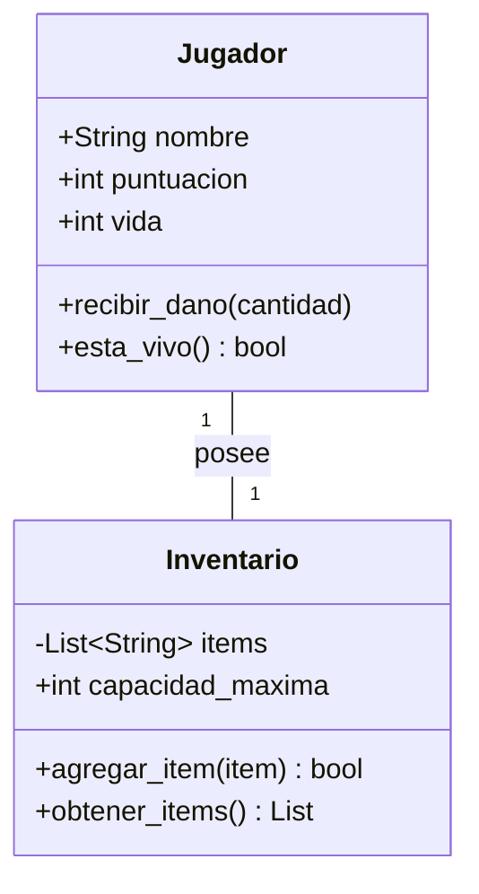

# Tema 2.3: Creación de componentes definidos por el usuario

Durante el desarrollo de nuestros proyectos, muchas veces los componentes que ofrecen las librerías no son suficientes o necesitamos encapsular cierta lógica junto a una interfaz para reutilizarla. Es aquí donde entra la **creación de componentes definidos por el usuario** (tanto visuales como no visuales).

## 1. Componentes No Visuales (Lógicos)
Son clases o módulos que encapsulan lógica de negocio, manejo de datos o cálculos, pero que no interactúan directamente con la interfaz gráfica.

### Ejemplo Python Clásico (Lógica de un Juego)
```python
class Jugador:
    def __init__(self, nombre):
        self.nombre = nombre
        self.puntuacion = 0
        self.vida = 100

    def recibir_dano(self, cantidad):
        self.vida -= cantidad
        if self.vida < 0:
            self.vida = 0
            
    def esta_vivo(self):
        return self.vida > 0

# Uso del componente no visual:
jugador1 = Jugador("Héroe")
jugador1.recibir_dano(30)
print(f"Vida restante: {jugador1.vida}")
```

### Conceptos Claves de Arquitectura de UI: "Estado" y "Eventos"

Cuando construyes o consumes componentes —especialmente visuales— trabajas con tres vectores principales de interactividad:
1.  **Propiedades (Props):** Son los atributos inmutables o la configuración inicial que se recibe fundamentalmente en el `__init__` (Ej. el Color primario, título, o el `valor_inicial`).
2.  **Estado Interno (State):** Los datos mutables y privados de un componente. Cuando este "Estado" se modifica, el framework asociado (como React, Flutter, o en este caso `Flet`) re-renderiza y dibuja nuevamente ese componente en la pantalla.
3.  **Manejadores de Eventos (Event Handlers):** Funciones vinculadas (Callbacks) a interacciones del usuario (clicks, presionar teclas o movimiento del ratón) que generalmente terminan actualizando el estado de ciertos componentes.

En el paradigma de Programación Orientada a Objetos, este aislamiento permite:
*   **Encapsulamiento:** Ocultar cómo ocurre el cálculo internamente. El módulo `main` no necesita saber cómo se realiza la suma o resta (ni modificar los textos internos); simplemente delega el uso al botón del componente, y este actualiza "su estado" propio.
*   **Reutilización Dinámica:** Instanciar 10, 20 o 50 Contadores se realiza en unas pocas líneas de código, porque todo el acoplamiento y control reside en una sola clase bien fundamentada.

### Diagrama UML del Componente No Visual


### Ejemplo Complementario: Componente `Inventario`
Añadiendo a la lógica anterior, podemos crear un componente esclavo e inyectarlo dentro del `Jugador`:

```python
class Inventario:
    def __init__(self, capacidad=5):
        self._items = []
        self.capacidad = capacidad
    
    def agregar(self, item):
        if len(self._items) < self.capacidad:
            self._items.append(item)
            return True
        return False
        
    def listar(self):
        return self._items

# Encapsulamiento funcional entre los dos componentes:
mochila_heroe = Inventario(capacidad=3)
mochila_heroe.agregar("Poción de Salud")
mochila_heroe.agregar("Espada de Hierro")
print(f"Llevas en el inventario: {mochila_heroe.listar()}")
```

## 2. Componentes Visuales con Flet
En Flet, podemos crear **controles de usuario** extendiendo la clase `ft.UserControl` (o heredando de contenedores como `ft.Column` / `ft.Container` en versiones actuales). Esto nos permite agrupar varios controles base (botones, textos) en una sola clase reutilizable.

### Ejemplo Práctico: Componente Visual `ContadorPersonalizado`

```python
import flet as ft

# Creación de un Componente Visual de Usuario
class ContadorPersonalizado(ft.Row):
    def __init__(self, valor_inicial=0):
        super().__init__()
        self.valor = valor_inicial
        
        # Componentes hijos
        self.texto = ft.Text(str(self.valor), size=20)
        
        # Botones agrupados
        self.controls = [
            ft.IconButton(ft.icons.REMOVE, on_click=self.restar),
            self.texto,
            ft.IconButton(ft.icons.ADD, on_click=self.sumar),
        ]
        self.alignment = ft.MainAxisAlignment.CENTER

    def sumar(self, e):
        self.valor += 1
        self.texto.value = str(self.valor)
        self.update()

    def restar(self, e):
        self.valor -= 1
        self.texto.value = str(self.valor)
        self.update()

# Aplicación principal
def main(page: ft.Page):
    page.title = "Mis Componentes Visuales"
    
    # Instanciamos múltiples veces nuestro nuevo componente visual
    contador_1 = ContadorPersonalizado(valor_inicial=10)
    contador_2 = ContadorPersonalizado(valor_inicial=0)
    
    page.add(
        ft.Text("Contador Superior:"),
        contador_1,
        ft.Text("Contador Inferior:"),
        contador_2
    )

if __name__ == "__main__":
    ft.app(target=main)
```

### Ejemplo Avanzado: Componente Compuesto `FormularioLogin`
Un componente visual a menudo agrupa a múltiples componentes, creando macro-componentes:

```python
class FormularioLogin(ft.Card):
    """Macro-componente que encapsula su propia validación y UI."""
    def __init__(self, on_submit):
        super().__init__()
        self.on_submit = on_submit # Callback a ejecutar cuando se envíe
        
        self.campo_usuario = ft.TextField(label="Usuario", prefix_icon=ft.icons.PERSON)
        self.campo_password = ft.TextField(label="Clave", password=True, can_reveal_password=True)
        self.boton_ingreso = ft.ElevatedButton("Ingresar", on_click=self.procesar_envio)
        self.mensaje_error = ft.Text(color="red", visible=False)
        
        self.content = ft.Container(
            content=ft.Column([
                self.campo_usuario,
                self.campo_password,
                self.boton_ingreso,
                self.mensaje_error
            ]), padding=20, width=300
        )
        
    def procesar_envio(self, e):
        # Lógica interna encapsulada
        if not self.campo_usuario.value or not self.campo_password.value:
            self.mensaje_error.value = "Ambos campos son obligatorios"
            self.mensaje_error.visible = True
            self.update()
        else:
            # Enviamos información hacia "arriba" (al main) al llamar la función ingresada por parámetro
            self.mensaje_error.visible = False
            self.update()
            self.on_submit(self.campo_usuario.value, self.campo_password.value)
```
Al crear este componente visual, logramos el **encapsulamiento y reutilización**, elementos fundamentales en Programación Orientada a Objetos.