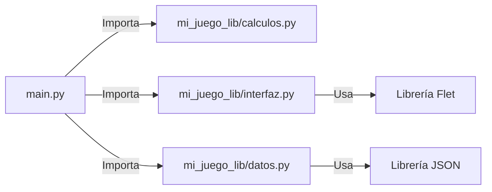

# Tema 2.4: Creación y uso de paquetes/librerías definidas por el usuario

Cuando nuestros proyectos crecen en tamaño y complejidad (como un juego interactivo completo o una aplicación con muchas vistas separadas), tener todo el código en un solo archivo `.py` es poco práctico e insostenible. 

La solución es organizar nuestras clases, componentes, funciones y constantes en **Paquetes y Módulos** definidos por nosotros mismos, para crear nuestras propias **Librerías Locales**.

### Beneficios Prácticos de Diseñar Paquetes
1.  **Evitar el "Código Espagueti":** Refactorizar un script enorme de miles de líneas en distintos archivos más especializados, pequeños y fáciles de entender reduce dramáticamente la complejidad cognitiva.
2.  **Manejo Seguro de Espacios de Nombres:** Varias áreas del juego pueden tener funciones llamadas igual (por ejemplo la clase `Manager` dentro de nuestro paquete `datos` y el `Manager` en `interfaz`), y al existir en módulos separados, nunca colapsarán entre sí.
3.  **Pensar a Largo Plazo (PyPI):** En Python, la estructura en paquetes que usas de manera local es la misma base inicial si el día de mañana deseas distribuir un trabajo para todo el mundo (subiendo ese paquete al servicio "Python Package Index" u otros repositorios empresariales).

### El Papel Crítico del archivo `__init__.py`
Al examinar la estructura, salta a la vista el uso del archivo "Dunder Init" (`__init__.py`).
*   **Indicador formal:** Le confiere la indicación al ecosistema de Python de decir *"Trata todo este directorio y sus carpetas como un empaquetado de importación"*.
*   **Control de Exportaciones (`__all__`):** Dentro del `__init__.py` puedes restringir qué clases están permitidas de exportarse o puedes simplificar la estructura. Por ejemplo:
    ```python
    # Contenido de mi_juego_lib/__init__.py
    
    # Simplificamos que al importar la librería completa, el desarrollador tenga directo acceso:
    from .calculos import calcular_experiencia
    from .interfaz import TarjetaPersonaje
    
    # Variable especial que declara lo que se exporta públicamente al hacer `from lib import *`
    __all__ = ["calcular_experiencia", "TarjetaPersonaje"]
    ```

## 1. Estructura de un Paquete Definido por el Usuario

Vamos a imaginar que creamos nuestras propias librerías agrupadas en un paquete llamado `mi_juego_lib`.

### Estructura de archivos:
```text
Proyecto/
│
├── mi_juego_lib/
│   ├── __init__.py           # Hace que Python reconozca el directorio como un paquete
│   ├── calculos.py           # Contiene lógica general no visual
│   ├── datos.py              # Componentes de manejo de la base de datos o almacenamiento
│   └── interfaz.py           # Contiene componentes visuales pre-armados
│
└── main.py                   # El archivo disparador que "usa" nuestras librerías
```

### Diagrama de Dependencias (Mermaid)


### 1.1 `mi_juego_lib/calculos.py`
En este script, creamos una simple función a modo de librería matemática pequeña centrada en nuestro negocio.
```python
# mi_juego_lib/calculos.py

def calcular_experiencia(nivel, multiplicador):
    """Calcula cuánta experiencia se necesita para subir de nivel."""
    return (nivel * 100) * multiplicador
```

### 1.2 `mi_juego_lib/datos.py` (Nuevo)
```python
# mi_juego_lib/datos.py
import json

class GestorPartida:
    """Componente lógico para guardar/cargar la partida."""
    def guardar_progreso(self, jugador_data, archivo="save.json"):
        with open(archivo, "w") as f:
            json.dump(jugador_data, f)
            print("Partida guardada exitosamente.")
```

### 1.3 `mi_juego_lib/interfaz.py`
En este script, creamos elementos genéricos de la interfaz. Esto actúa como un módulo para componentes creados en el tema 2.3.
```python
# mi_juego_lib/interfaz.py
import flet as ft

class TarjetaPersonaje(ft.Card):
    """Componente visual pre-fabricado."""
    def __init__(self, nombre, nivel):
        super().__init__()
        self.content = ft.Container(
            content=ft.Column([
                ft.Text(f"Nombre: {nombre}", size=18, weight=ft.FontWeight.BOLD),
                ft.Text(f"Nivel: {nivel}")
            ]),
            padding=10
        )
```

## 2. Uso del Paquete Definido por el Usuario (`main.py`)

Finalmente, importamos nuestra pequeña librería o paquete hacia la entrada principal de nuestro programa:

```python
# main.py
import flet as ft

# Aquí estamos importando y haciendo USO de PAQUETES definidos por el usuario!
from mi_juego_lib.calculos import calcular_experiencia
from mi_juego_lib.interfaz import TarjetaPersonaje
from mi_juego_lib.datos import GestorPartida

# Nota Adicional: Tipos de Importación
# Estas importaciones anteriores son conocidas como "Importaciones Absolutas" 
# (porque inician indicando el paquete raíz de nuestro proyecto `mi_juego_lib`).
# Los paquetes del usuario también soportan "Importaciones Relativas", 
# por ejemplo: en vez de `from mi_juego_lib.datos`, podríamos usar `from .datos`
# si nos encontramos en el mismo nivel, navegando con el símbolo de punto (.).

def main(page: ft.Page):
    # Uso de lógica matemática de nuestro paquete
    exp_necesaria = calcular_experiencia(nivel=5, multiplicador=1.5)
    print(f"Se necesitan {exp_necesaria} xp.")

    # Guardando progreso usando nuestro módulo de datos
    gestor = GestorPartida()
    gestor.guardar_progreso({"nombre": "Juan", "nivel": 5})

    # Uso de componente de UI de nuestro paquete
    tarjeta = TarjetaPersonaje("Aventurero Juan", 5)
    
    page.add(
        ft.Text("Personaje Activo:", size=20),
        tarjeta
    )

if __name__ == "__main__":
    ft.app(target=main)
```

De esta manera, dividimos nuestro problema, desarrollamos herramientas de forma modular y las **reutilizamos**.